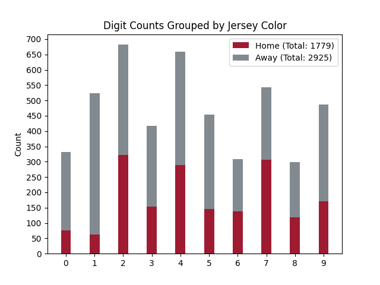

# Jersey Number Dataset

## Example Images

<!--|::|:----------:|:----------:|
| ![][pic1]  | ![][pic2]  | ![][pic3]  |
|   |   |   |
|   |   |   |
|   |  |  |
-->
| | | |
|:----------:|:----------:|:----------:|
| ![][pic1]  | ![][pic2]  | ![][pic3]  |
| ![][pic4]  | ![][pic5]  | ![][pic6]  |
| ![][pic7]  | ![][pic8]  | ![][pic9]  |
| ![][pic10]  | ![][pic11] | ![][pic12] |

[pic1]: readme_assets/pic1.png
[pic2]: readme_assets/pic2.png
[pic3]: readme_assets/pic3.png
[pic4]: readme_assets/pic4.png
[pic5]: readme_assets/pic5.png
[pic6]: readme_assets/pic6.png
[pic7]: readme_assets/pic7.png
[pic8]: readme_assets/pic8.png
[pic9]: readme_assets/pic9.png
[pic10]: readme_assets/pic10.png
[pic11]: readme_assets/pic11.png
[pic12]: readme_assets/pic12.png

## Data Distribution

## How It Was Made

1. Used [4K Video Downloader](https://www.4kdownload.com/products/product-videodownloader) to download two highlight videos of Alabama football broadcast game footage from the [2014 Iron Bowl](https://www.youtube.com/watch?v=Fh7bYnoFMYM) and [2015 National Championship](https://www.youtube.com/watch?v=mBHvIf84L5k). The videos were downloaded at 720p quality. The players wore home jerseys for the iron bowl game and away jerseys for the national championship.

1. Ran [frameGrabber.py](util/frameGrabber.py) to capture frames from the two downloaded videos. The `frameGrabber` utility allows the user to toggle capturing on/off as the video plays. This functionality was used to focus frame captures on live action. Frames captured from both videos totaled 2924 and are stored under `raw/`.

1. Loaded the 2924 frames into a [VIA](http://www.robots.ox.ac.uk/~vgg/software/via/) project (`raw_frame_selection_via_project.json`) then manually removed frames from the project that did not contain a single visible Alabama jersey number. This whittled the 2924 frames down to 1832.

1. Ran a [pre-trained Mask R-CNN](https://github.com/matterport/Mask_RCNN) to extract person bounding boxes from the 1832 frames, producing 11414 candidate person proposals stored under `person_proposals/`. The proposals were padded with blackness to produce a square shape then scaled to 256x256. This step was performed by running `mask_rcnn_extract_person_proposals.ipynb` in Google Colab.

1. Loaded the 11414 person proposals into a [VIA](http://www.robots.ox.ac.uk/~vgg/software/via/) project (`jersey_number_labelling_via_project.json`) then manually removed proposals from the project that did not contain a visible Alabama jersey number. This whittled the 11414 proposals down to 2401 proposals.

1. Setup a [Mechanical Turk](https://www.mturk.com/) project to crowdsource labelling visible jersey number digits found in the 2401 person proposals with bounding boxes and a digit label (0 to 9).

1. The workers finished in 21 minutes, but the results were inconsistent. Using an [import script](mTurk/import_mTurk_results.py), the worker submissions were loaded into the existing VIA project (`jersey_number_labelling_via_project.json`) and used as a starting point for a manual labelling process using the VIA tool.

1. Worker feedback was provided using a [script](mTurk/createWorkerFeedback.py) to score the original submissions against the final results. The script looked for two common pitfalls, but it errored on the side of generosity. Ultimately, 1871 submissions were approved and 551 were rejected; however, the vast majority of the submissions required some manual refinement.

1. The final dataset was exported from VIA as `jersey_number_coco.json`. The referenced images reside under `person_proposals/`.
